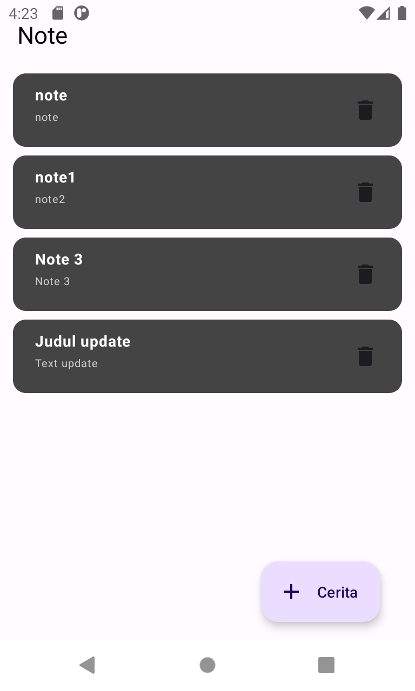

# Android - Note App (Phincon Test)

`MVVM Architecture` is one of the most popular architecture to develop an app. MVVM architectural pattern divides an application into three key components: Model, View, and ViewModel. Model: This is your business logic and data. Here, you process data, perform operations, and interact with data sources. View: This is the User Interface (UI). ViewModel: Acts as a mediator between the model and view.
This `Note` Android App i build using `kotlin` and `jetpack compose`. I use `Room DB` for local database in this application.

 

## Prerequisites

Basic `Kotlin` and `Jetpack Compose`, knowledge of `Database` by Room library.

## Project Description

I build a Note Application with MVVM Architecture. The UI will be as like as above screenshot. There is a `FAB Create` where you can create a note for yourself and in the `Note Card` there is a delete icon to delete the note when you no longer needed the note.

## Libraries 

* [Room]([https://coil-kt.github.io/coil/compose/](https://developer.android.com/reference/androidx/room/package-summary)) for Database
* [Ksp](https://github.com/google/ksp/releases) for Annotation Processors

## Run Project

This project was build on `JDK 1.8`. Sync the `Gradle` and run the project. Install APK on your emulator or real device.
